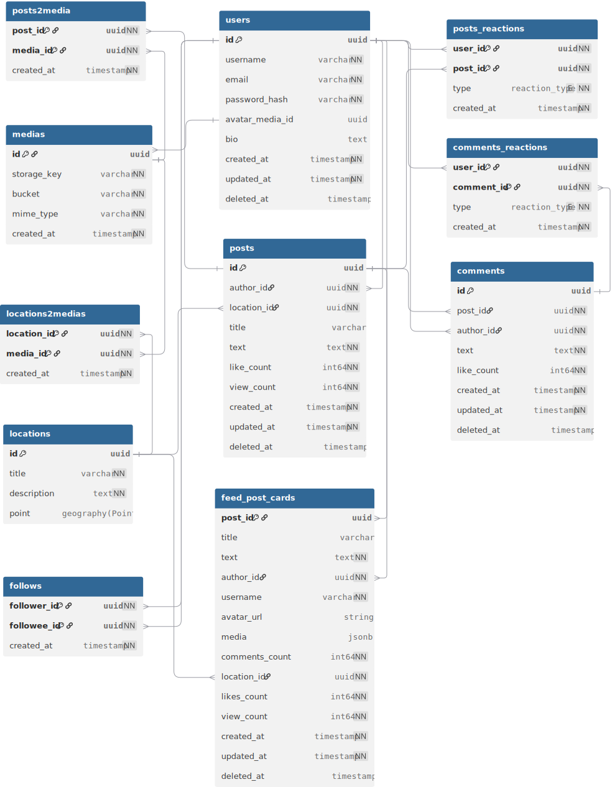

# Social Network System Design

System Design социальной сети для курса по System Design.

## Функциональные требования

- Регистрация:
  - username;
  - email;
  - password;
  - avatar.

- Вход:
  - по паре `username/email + password`;
  - через социальные сети (OAuth 2.0).

- Выход из аккаунта.

- Смена и восстановление пароля.

- Редактирование профиля:
  - avatar;
  - bio.

- Посты с фотографиями, небольшим описанием и геолокацией:
  - пост привязывается к локации из справочника `Location`;
  - полный просмотр поста;
  - просмотр поста в ленте (краткое представление);
  - создание;
  - редактирование;
  - удаление.

- Реакции на публикациях:
  - можно поставить только один тип реакции: `like` или `dislike`;
  - реакцию можно изменить;
  - список пользователей, поставивших реакцию, не публичен.

- Комментарии под публикациями:
  - добавление;
  - удаление;
  - комментарии доступны на странице поста и выводятся с пагинацией;
  - комментарии можно оценивать лайком;
  - ответы на комментарии не поддерживаются;
  - в ленте комментарии под постами не отображаются (только счётчик комментариев).

- Подписки на аккаунты:
  - подписаться на аккаунт;
  - отписаться от аккаунта;
  - просмотреть список своих подписок;
  - просмотреть список своих подписчиков.

- Писать посты, комментарии и ставить реакции могут только зарегистрированные пользователи.

- Поиск постов по локациям:
  - сортировка: по дате добавления, по популярности;
  - просмотр постов по локации;
  - топ мест за день/месяц/год.

- Лента постов подписок:
  - в обратном хронологическом порядке;
  - выводится с пагинацией.

- Просмотр постов выбранного пользователя:
  - в обратном хронологическом порядке;
  - выводится с пагинацией.

- Все списки выводятся с пагинацией.

## Нефункциональные требования

- DAU: для расчётов принимаем `15_000_000`.
- Основная аудитория: страны СНГ.
- Данные хранятся бессрочно.
- Приложение доступно:
  - web-версия для современных браузеров;
  - нативные мобильные приложения на Android и iOS.

- Активность пользователей (в среднем на 1 DAU):
  - 1 пост в неделю, до 5 фотографий в посте;
  - 2 комментария в сутки;
  - 10 прочитанных комментариев в сутки;
  - 5 открытий ленты в сутки по 20 постов;
  - 5 открытий полного поста в сутки;
  - 10 реакций в сутки;
  - 2 поисковых запроса в сутки.

- Лимиты:
  - к посту можно прикрепить не более 5 фотографий;
  - длина текста поста: до 1000 символов;
  - не более 1000 реакций в сутки на пользователя;
  - не более 20 постов в сутки на пользователя;
  - не более 100 комментариев в сутки на пользователя;
  - размер одного фото: до 20 MB;
  - не более 100 поисковых запросов в сутки на пользователя.

- Сезонность:
  - летом и в новогодние праздники нагрузка может вырастать в 3 раза.

- SLA и latency:
  - создание поста: не более 3 с;
  - загрузка одной фотографии: не более 5 с;
  - добавление реакции: не более 1 с;
  - добавление комментария: не более 1 с;
  - после публикации пост появляется в ленте не позднее, чем через 30 с;
  - комментарий после публикации появляется не позднее, чем через 10 с;
  - API latency: `p95 < 500 ms` для операций чтения и записи.

- Доступность: `99.95%`.

## Доменная модель

- `User` (546 B):
  - id uuid (16 B)
  - username string (~10 символов ASCII = 10 B)
  - email string (~20 символов ASCII = 20 B)
  - password_hash string (~60 символов ASCII = 60 B)
  - avatar_media_id uuid (16 B)
  - bio string (~200 символов кириллицы = 400 B)
  - created_at timestamp (8 B)
  - updated_at timestamp (8 B)
  - deleted_at timestamp (8 B)

- `Post` (2288 B):
  - id uuid (16 B)
  - author_id uuid (16 B)
  - title string (~100 символов кириллицы = 200 B)
  - text string (~1000 символов кириллицы = 2000 B)
  - location_id uuid (16 B)
  - like_count int64 (8 B)
  - view_count int64 (8 B)
  - created_at timestamp (8 B)
  - updated_at timestamp (8 B)
  - deleted_at timestamp (8 B)

- `Media` (184 B):
  - id uuid (16 B)
  - bucket string (~ 30 B)
  - storage_key string (~120 символов ASCII = 120 B)
  - mime_type string (~10 символов ASCII = 10 B)
  - created_at timestamp (8 B)

- `PostMedia` (40 B):
  - post_id uuid (16 B)
  - media_id uuid (16 B)
  - created_at timestamo (16 B)

- `Comment` (2080 B):
  - id uuid (16 B)
  - post_id uuid (16 B)
  - author_id uuid (16 B)
  - text string (~1000 символов кириллицы = 2000 B)
  - like_count int64 (8 B)
  - created_at timestamp (8 B)
  - updated_at timestamp (8 B)
  - deleted_at timestamp (8 B)

- `PostReaction` (44 B):
  - user_id uuid (16 B)
  - post_id uuid (16 B)
  - type enum(`like`, `dislike`) (4 B)
  - created_at timestamp (8 B) 

- `CommentReaction` (44 B):
  - user_id uuid (16 B)
  - comment_id uuid (16 B)
  - type enum(`like`, `dislike`) (4 B)
  - created_at timestamp (8 B) 

- `Location` (2232 B):
  - id uuid (16 B)
  - title string (~100 символов кириллицы = 200 B)
  - description string (~1000 символов кириллицы = 2000 B)
  - lat float64 (8 B)
  - lon float64 (8 B)

- `LocationMedia` (40 B):
  - location_id uuid (16 B)
  - media_id uuid (16 B)
  - created_at timestamp (8 B) 

- `Follow` (40 B):
  - follower_id uuid (16 B)
  - followee_id uuid (16 B)
  - created_at timestamp (8 B)

- `FeedPostCard` (2426 B)
  - post_id uuid (16 B)
  - title string (~100 символов кириллицы = 200 B)
  - text string (~1000 символов кириллицы = 2000 B)
  - author_id uuid (16 B)
  - username string (~10 символов ASCII = 10 B)
  - avatar_url string (~120 символов ASCII = 120 B)
  - media jsonb // [{media_id, s3_key, mime}, ...] (~ 1000 B)
  - comments_count int64 (8 B)
  - location_id uuid (16 B)
  - likes_count int64(8 B)
  - view_count int64 (8 B)
  - created_at timestamp (8 B)
  - updated_at timestamp (8 B)
  - deleted_at timestamp (8 B)

## Оценка объёма данных

- Метаданные полного поста (post + 5 media metadata): `2288 + 5 * 184 = 3208 B`
- Метаданные карточки поста в ленте/поиске: `2426 B`
- Медиа поста (5 фотографий по 5 MB): `25_000_000 B`
- Сжатое медиа для ленты/поиска (5 фотографий по 500 KB): `2_500_000 B`
- Комментарий: `2080 B`
- Реакция под постом или комментарием: `44 B`

## Оценка нагрузки

### Посты

- `RPS write`: `15_000_000 / 86400 / 7 = 24.8 ~= 25`
- `RPS read`: `15_000_000 * 5 / 86400 = 868.1 ~= 868`

- `Traffic write`: `25 * 3208 = 80_200 B/s`
- `Traffic read`: `868 * 3208 = 2_784_544 B/s`

### Медиа в посте

- `RPS write`: `25 * 5 = 125`
- `RPS read`: `868 * 5 = 4340`

- `Traffic write`: `125 * 5_000_000 = 625_000_000 B/s`
- `Traffic read`: `4340 * 5_000_000 = 21_700_000_000 B/s`

### Лента

- `RPS read`: `15_000_000 * 5 * 20 / 86400 = 17_361.1 ~= 17_361`

- `Traffic read`: `17_361 * 2426 = 42_117_786 B/s`

### Медиа в ленте

- `RPS read`: `17_361 * 5 = 86_805`

- `Traffic read`: `86_805 * 500_000 = 43_402_500_000 B/s`

### Поиск

- `RPS read`: `15_000_000 * 2 / 86400 = 347.2 ~= 347`

- `Traffic read`: `347 * 2426 = 841_822 B/s`

### Медиа в поиске

- `RPS read`: `347 * 1 = 347`

- `Traffic read`: `347 * 500_000 = 173_500_000 B/s`

### Комментарии

- `RPS write`: `15_000_000 * 2 / 86400 = 347.2 ~= 347`
- `RPS read`: `15_000_000 * 10 / 86400 = 1736.1 ~= 1736`

- `Traffic write`: `347 * 2080 = 721_760 B/s`
- `Traffic read`: `1736 * 2080 = 3_610_880 B/s`

### Реакции

- `RPS write`: `15_000_000 * 10 / 86400 = 1736.1 ~= 1736`

- `Traffic write`: `1736 * 44 = 76_384 B/s`

## Оценка требуемой памяти

**Формулы:**
- `Disks_for_capacity = capacity / disk_capacity`
- `Disks_for_throughput = traffic_per_second / disk_throughput`
- `Disks_for_iops = iops / disk_iops`
- `Disks = max(ceil(Disks_for_capacity), ceil(Disks_for_throughput), ceil(Disks_for_iops))`

**Где:**
- **disk_capacity** - объем одного диска 
- **capacity** - суммарный объем данных, которое необходимо хранить 
- **traffic_per_second** - суммарный трафик на запись/чтение в секунду 
- **disk_throughput** - пропускная способность одного диска 
- **iops** - суммарное количество запросов в секунду 
- **disk_iops** - количество операций ввода-вывод диска в секунду 
- **ceil** - функция округления вверх до целого числа

### Посты, поиск и лента (SSD nvme)
- `Capacity: Capacity: (80_200 + 76_384) B/s * 86_400 * 365 = 4_938_033_024_000 B / (1024^4) ≈ 4.491 TiB`
- `Traffic_per_second: 80_200 + 42_117_786 + 2_784_544 + 841_822 = 45_824_352 B/s / (1024 * 1024) ≈ 43.70 MiB/s`
- `IOPS: 25 + 868 + 1736 + 17_361 + 347 = 20_337`
- 
- `Disks_for_capacity = 4.491 TiB / 10 TiB ≈ 0.449`
- `Disks_for_throughput = 43.70 MiB/s / (3 * 1024) MiB/s ≈ 0.014`
- `Disks_for_iops = 20_337 / 10000 ≈ 2.03`
- 
- `isks = max(ceil(0.449), ceil(0.014), ceil(2.03)) = 3`

### Медиа в постах, ленте, поиске на первые 2 месяца (SSD SATA)
- `Capacity: 625_000_000 B/s * 86_400 * 60 = 3_240_000_000_000_000 B ≈ 2_946.76 TiB`
- `Traffic_per_second = 625_000_000 + 21_700_000_000 + 173_500_000 + 43_402_500_000 = 65_901_000_000 B/s ≈ 62_848.09 MiB/s`
- `IOPS: 125 + 4340 + 347 + 86_805 = 91_617`
- 
- `Disks_for_capacity = 2_946.76 TiB / 100 TiB ≈ 29.5`
- `Disks_for_throughput = 62_848.09 MiB/s / 500 MiB/s ≈ 125.7`
- `Disks_for_iops = 91_617 / 1000 = 91.6`
- 
- `Disks = max(ceil(29.5), ceil(125.7), ceil(91.6)) = 126`

### Медиа в постах, ленте, поиске на 10 месяцев при нагрузке на чтение в 10% от исходной (HDD)
- `Capacity: 625_000_000 B/s * 86_400 * 300 = 16_200_000_000_000_000 B ≈ 14_733.81 TiB`
- `Traffic_per_second = 625_000_000 + (21_700_000_000 + 173_500_000 + 43_402_500_000) * 0.1 = 7_152_600_000 B/s ≈ 6_821.25 MiB/s`
- `IOPS: 125 + (4340 + 347 + 86_805) * 0.1 = 9_274.2`
- 
- `Disks_for_capacity = 16_200 TB / 32 TB = 506.25`
- `Disks_for_throughput = 6_821.25 MiB/s / 100 MiB/s ≈ 68.2`
- `Disks_for_iops = 9_274.2 / 100 = 92.7`
- 
- `Disks = max(ceil(506.25), ceil(68.2), ceil(92.7)) = 507`

### Комментарии (SSD nvme)
- `Capacity: 721_760 B/s * 86_400 * 365 ≈ 20.7 TiB`
- `Traffic_per_second = 721_760 + 3_610_880 ≈ 4.13 MiB/s`
- `IOPS: 347 + 1736 = 2083`
- 
- `Disks_for_capacity = 20.7 TiB / 25 TiB ≈ 0.8`
- `Disks_for_throughput = 4.13 MiB/s / 10000 MiB/s ≈ 0.0004`
- `Disks_for_iops = 2083 / 10000  = 0.2`
- 
- `Disks = max(ceil(0.8), ceil(0.04), ceil(0.2)) = 1`

## Модель хранения данных
